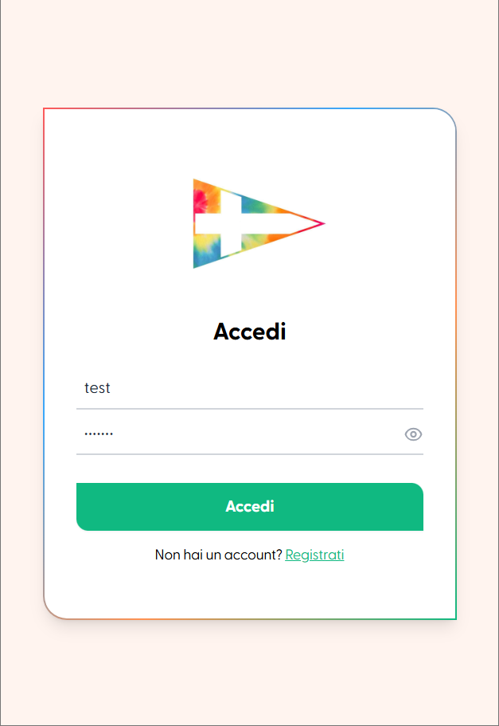
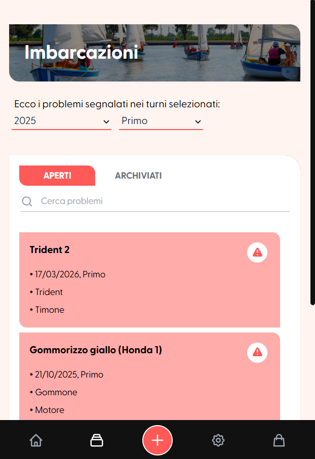
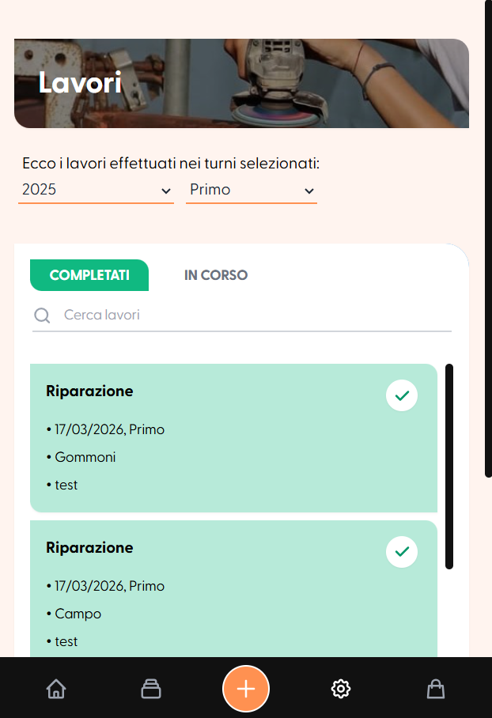
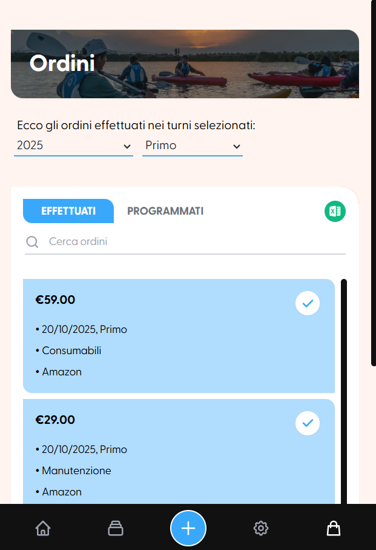

# Management App - LNI Nazioni
This project was a personal challenge of redesigning the management tool used at the Italian Naval League nautical center I work at seasonally. The existing software had a rough interface and limited features, so I used it as a practical case study to build a modern, mobile-first alternative from scratch.

The app ran end-to-end on Render during testing and is production-ready, though not officially in use at the center (yet!). Though I built the backend in Python from scratch, the bulk of my effort went into UX, working with TypeScript and Tailwind CSS to match the frictionless feel of the apps I and the staff use daily.

<p align="center">
  <table border="0">
    <tr>
      <td align="center" valign="top">
        <br>
        <em>Secure Login</em>
      </td>
      <td align="center" valign="top">
        <br>
        <em>Dynamic Dashboard</em>
      </td>
      <td align="center" valign="top">
        <br>
        <em>Boats Management</em>
      </td>
    </tr>
  </table>
</p>

## Key features
- Season and shift-based filtering across all views.
- Bottom-sheet modals for data entry without losing page context.
- Excel export for orders and shift reports.
- One-tap status toggles on list items (open → closed, pending → completed).

<p align="center">
  <table border="0">
    <tr>
      <td align="center" valign="top">
        <br>
        <em>Interactive Toggle (GIF)</em>
      </td>
      <td align="center" valign="top">
        <br>
        <em>Works Tracking</em>
      </td>
      <td align="center" valign="top">
        <br>
        <em>Orders Management</em>
      </td>
    </tr>
  </table>
</p>

## Tech stack

| Layer | Technology |
|-------|-----------|
| **Frontend** | React, Vite, TypeScript, Tailwind CSS |
| **Backend** | FastAPI, Python, SQLAlchemy ORM |
| **Database** | PostgreSQL 15 (Docker) |
| **Auth** | JWT via Bearer token |

## Architecture
```
React SPA → Axios (JWT) → FastAPI routes → Pydantic validation → SQLAlchemy ORM → PostgreSQL
```

The frontend is a decoupled SPA that never touches the database directly. FastAPI exposes RESTful endpoints grouped by domain (/orders, /boats, /problems, /reports). Pydantic schemas strictly validate every incoming payload before it reaches the ORM layer — ensuring sensitive fields (like password hashes) are explicitly excluded from API responses.

## How to run locally

**1. Database**
```bash
cd backend 
sudo docker compose up -d
```

**2. Backend**
```bash
cd backend
source .venv/bin/activate
uvicorn app.main:app --reload
# → API live at: http://127.0.0.1:8000
```

**3. Frontend**
```bash
cd frontend 
npm install 
npm run dev
# → App live at: http://localhost:3000
```

## Future work

- **Auth storage:** JWTs are currently stored in `localStorage`, which is vulnerable to XSS. Moving to `HttpOnly` secure cookies is the planned production-ready alternative.
- **No RBAC:** All authenticated users currently share the same permission level. An Admin/User hierarchy is required before wider deployment.
- **No automated tests:** The current version relies on extensive manual edge-case testing. Implementing an automated test suite (`pytest` for backend, `Cypress` for frontend) is the next structural step.
